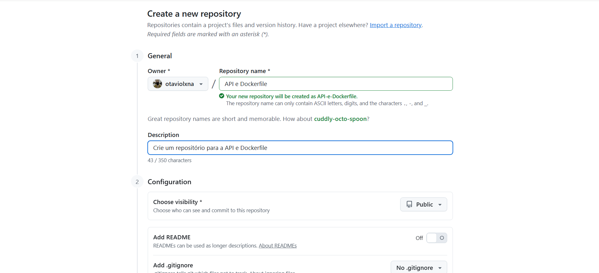
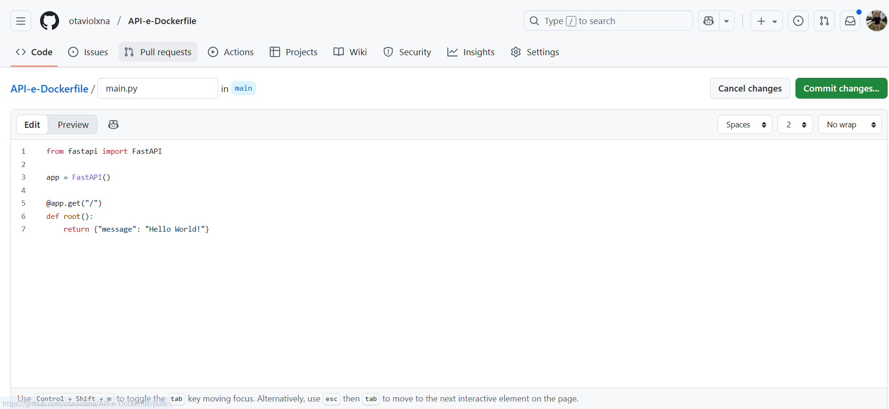
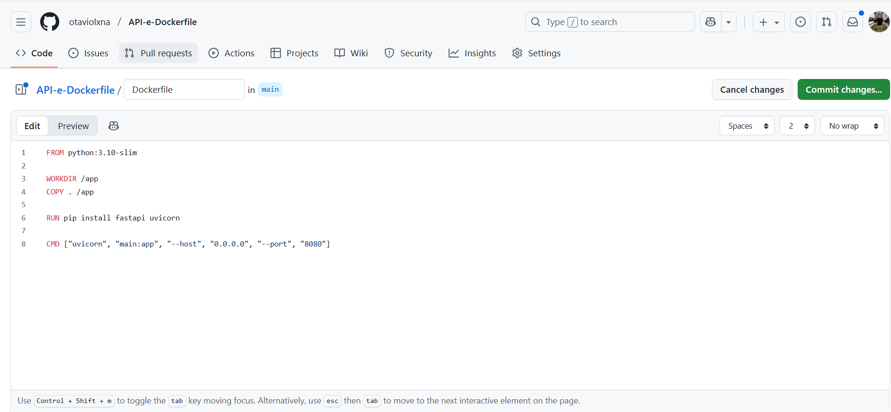
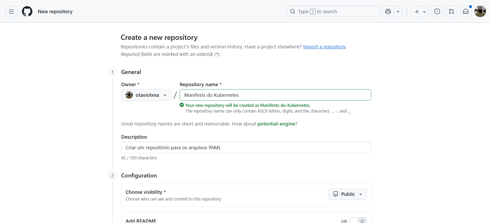
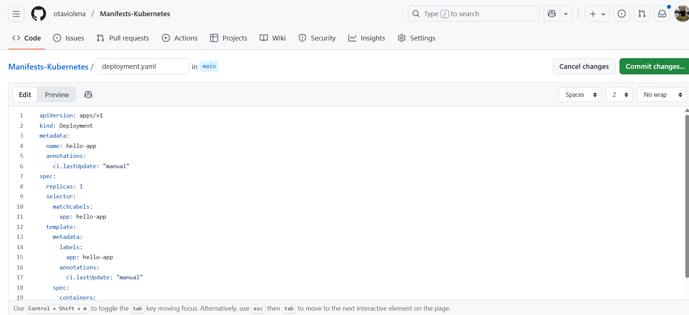
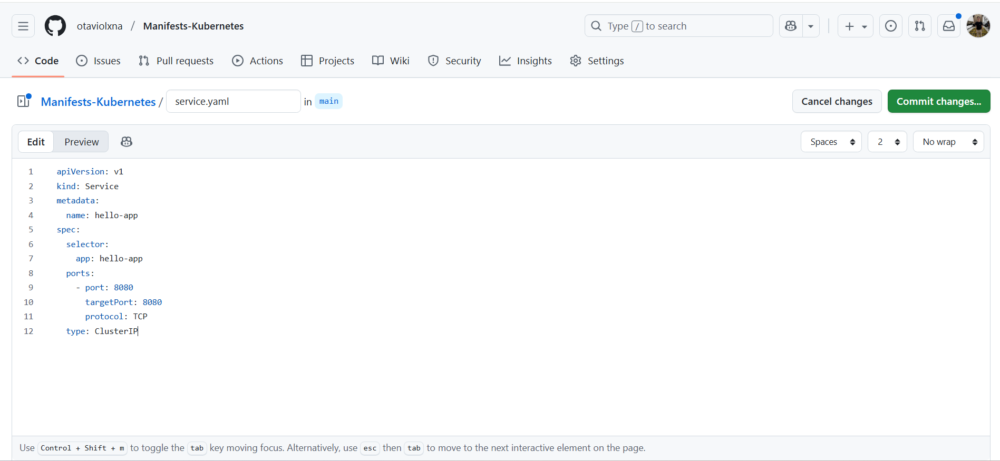
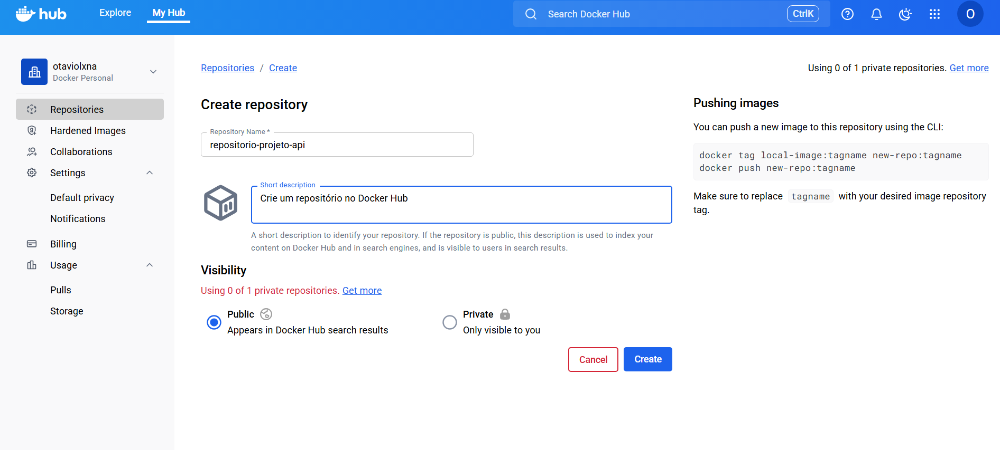
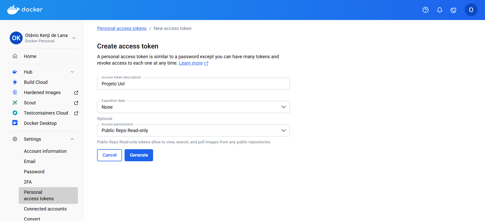

# 🚀 CI/CD com API + Docker + GitHub Actions + Argo CD

> **Objetivo:**  
> Automatizar **build**, **push** e **deploy** de uma API FastAPI em **Kubernetes local (Rancher Desktop)** usando **Docker Hub** como registry, **GitHub Actions** para CI/CD e **Argo CD** para entrega contínua (GitOps).

## ⚙️ Tecnologias

<div align="center">

  <!-- Linguagem & Framework -->
  
  
  <!-- Container & Registry -->
  
  

  <!-- CI/CD -->
  

  <!-- Orquestração & GitOps -->
  
  
  

</div>

---

## ✅ Pré-requisitos

- 🧠 **Windows 10/11** com **PowerShell**
- 🐳 **Rancher Desktop** com Kubernetes habilitado (`v1.28+`)
  ```bash
  kubectl config use-context rancher-desktop
  kubectl get nodes
  ```
- ☁️ **Conta no GitHub**
  - Repositórios: `projeto-uol-api` e `projeto-kubernetes-deployments`
- 🐋 **Conta no Docker Hub**
  - Repositório público: `otaviolxna/hello-app`
- 🔧 **Argo CD** instalado no cluster

---

## 📁 Estrutura dos repositórios

| Repositório | Função |
|--------------|--------|
| **projeto-uol-api** | Contém a API FastAPI, Dockerfile e workflow do GitHub Actions |
| **projeto-kubernetes-deployments** | Contém os manifests Kubernetes (`deployment.yaml`, `service.yaml`) observados pelo Argo CD |

---

## 🧩 1. Repósitorio API e Workflows

1. Crie um repositório público



2. Adicione os seguintes arquivos:

**`main.py`**
```python
from fastapi import FastAPI

app = FastAPI()

@app.get("/")
def root():
    return {"message": "Hello World!"}
```



**`Dockerfile`**
```dockerfile
FROM python:3.10-slim

WORKDIR /app
COPY . /app

RUN pip install fastapi uvicorn

CMD ["uvicorn", "main:app", "--host", "0.0.0.0", "--port", "8080"]
```



---

## ⚙️ 2. Repositório Manifests do Kubernetes

1. Crie um novo repositório público para os manifests do Kubernetes:



2. 
**`deployment.yaml`**
```yaml
apiVersion: apps/v1
kind: Deployment
metadata:
  name: hello-app
  annotations:
    ci.lastUpdate: "manual"
spec:
  replicas: 1
  selector:
    matchLabels:
      app: hello-app
  template:
    metadata:
      labels:
        app: hello-app
      annotations:
        ci.lastUpdate: "manual"
    spec:
      containers:
        - name: hello-app
          image: otaviolxna/hello-app:latest
          imagePullPolicy: Always
          ports:
            - containerPort: 8080
          readinessProbe:
            httpGet:
              path: /
              port: 8080
            initialDelaySeconds: 3
            periodSeconds: 5
          livenessProbe:
            httpGet:
              path: /
              port: 8080
            initialDelaySeconds: 10
            periodSeconds: 10
```



**`service.yaml`**
```yaml
apiVersion: v1
kind: Service
metadata:
  name: hello-app
spec:
  selector:
    app: hello-app
  ports:
    - protocol: TCP
      port: 8080
      targetPort: 8080
  type: ClusterIP
```



---

## 🐋 3. Publicar no Docker Hub

Crie um repositório público no Docker Hub: 

Exemplo:
➡️ `otaviolxna/hello-app`

As tags geradas:
- `latest`
- `<sha-curto>` (ex: `a12bc34d5f6`)



---

## ⚙️ 4. GitHub Actions (CI/CD)

## 🔐 4. Configurando os Secrets do GitHub Actions

Para que o pipeline consiga:
- Fazer **login no Docker Hub** (para publicar as imagens);
- Ter permissão de **editar o repositório de manifests** (para atualizar o `deployment.yaml`);
- E autenticar com segurança, **sem expor senhas no código**;

...é necessário configurar **3 secrets** no repositório da **api`**.

---

### 🧭 Passo a passo

1. **Acesse o repositório da API no GitHub**  

2. Vá até:  
   **Settings → Secrets and variables → Actions → New repository secret**

4. Agora você criará **três secrets** (um de cada vez):

---

### 🧩 Secret 1 — `DOCKER_USERNAME`

- **Valor:** seu nome de usuário do Docker Hub  
  Exemplo:
  otaviolxna
```

- **Função:** permite que o GitHub Actions saiba **qual conta Docker** usar para enviar imagens (`docker push`).

---

### 🧩 Secret 2 — `DOCKER_PASSWORD`

- **Valor:** um **Access Token** do Docker Hub (não a senha da conta).  
Para gerar:
1. Acesse [hub.docker.com](https://hub.docker.com)
2. Vá em **Account Settings → Security → New Access Token**
3. Dê um nome (ex: `projeto uol`)



4. Copie o token gerado
5. Cole no campo de valor do secret no GitHub

⚠️ **Importante:** esse token é exibido apenas uma vez — se perder, gere outro.

---

### 🧩 Secret 3 — ``


---

## 🧭 5. Instalar o Argo CD no Rancher Desktop

```bash
kubectl create namespace argocd
kubectl apply -n argocd -f https://raw.githubusercontent.com/argoproj/argo-cd/stable/manifests/install.yaml
kubectl get pods -n argocd
```

### Acessar o painel
```bash
kubectl port-forward -n argocd svc/argocd-server 9090:443
```
Acesse em: [http://localhost:9090](http://localhost:9090)

Login: Admin

Senha: (Rodar no PowerShell)
```powershell
kubectl -n argocd get secret argocd-initial-admin-secret ` -o jsonpath="{.data.password}" | %{ [System.Text.Encoding]::UTF8.GetString([System.Convert]::FromBase64String($_)) }
```

---

## 🌐 6. Criar o App no Argo CD

- **Application Name:** `hello-app`
- **Project:** `default`
- **Repository URL:** `https://github.com/otaviolxna/projeto-kubernetes-deployments`
- **Revision:** `main`
- **Path:** `/`
- **Cluster:** `in-cluster`
- **Namespace:** `default`
- **Sync Policy:** ✅ Enable Auto-Sync

> 💡 Em ambiente local, o auto-sync depende de polling.
> 
---

## 🌍 7. Acesso à aplicação

**Via Port-Forward:**
```bash
kubectl port-forward -n default svc/hello-app 8080:8080
# Acesse em http://localhost:8081
```

---

## 🔄 8. Fluxo de Atualização

1. Edite a mensagem no `projeto-uol-api`  
2. GitHub Actions builda e publica a imagem  
3. Faz commit no `projeto-kubernetes-deployments`  
4. Argo CD detecta → sincroniza → cria novo pod  
5. Atualização visível na URL da API 🎉

---

## 🏁 Conclusão

Com esse projeto, você aprendeu a:
- Criar pipelines CI/CD reais com **GitHub Actions**
- Publicar imagens Docker automaticamente
- Aplicar o modelo **GitOps** com **Argo CD**
- Entregar uma API **FastAPI** totalmente automatizada 🎯

---

## ✨ Sobre mim

Olá! 👋 Sou **Otávio Lana**, estudante de **Segurança da Informação** e entusiasta de **DevSecOps** e **Cloud Security**.  
Atualmente sou estagiário na **UOL Compass**, com foco em **AWS, automação e práticas de FinOps**.  
Meu objetivo é crescer na área de segurança em nuvem e levar meus projetos para o nível internacional 🌎.

Gosto de transformar aprendizado em prática — seja construindo pipelines, automatizando deploys ou criando conteúdos sobre cibersegurança e tecnologia.  
Se você curtiu este projeto, sinta-se à vontade para **⭐ dar uma estrela** e contribuir! 😄

💼 [LinkedIn](https://www.linkedin.com/in/otaviolxna) 

</div>
